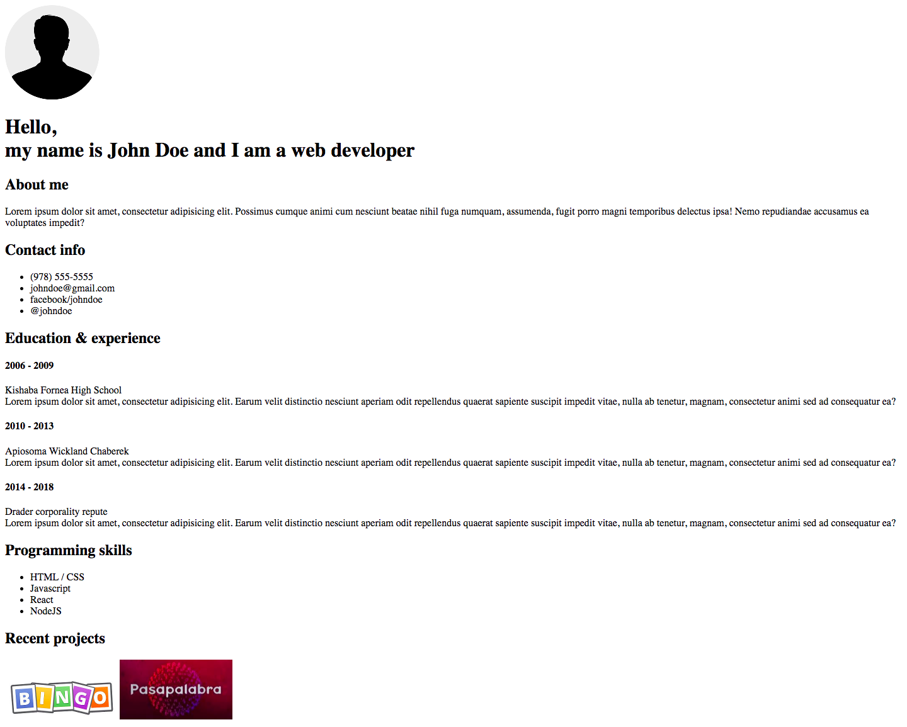

# Curriculum Vitae [timing 1h]

## Goals

- Introduction HTML tags
- Create CV

## Tasks

- Create a Curriculum Vitae using only the following html tags: 

```
h1, h2, h4, p, br, ul, li, img
```

- The CV should look like this:

