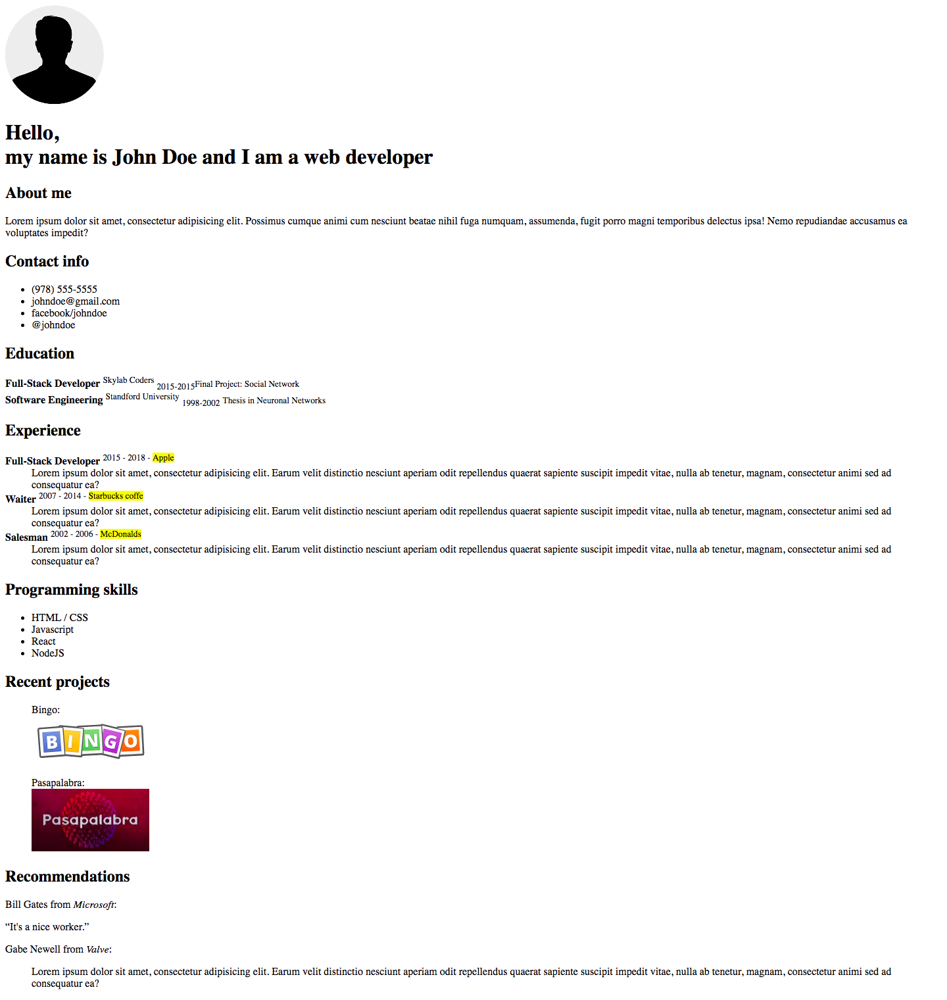

# Curriculum Vitae [timing 1h]

## Goals

- Introduction HTML tags
- Create CV

## Tasks

- Modify the Curriculum Vitae using the following html tags: 

```
section, figure, figcaption, blockquote, q, em, strong, small, sub, sup, dl, dt, dd, mark
```

- The CV should look like this:

