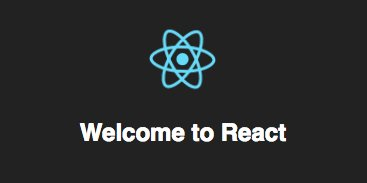
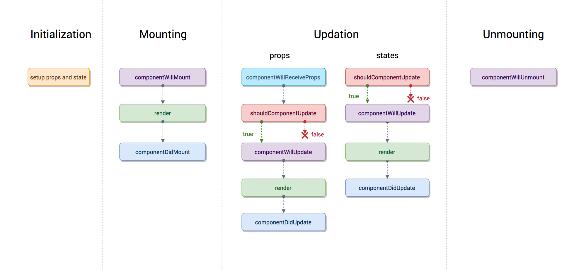
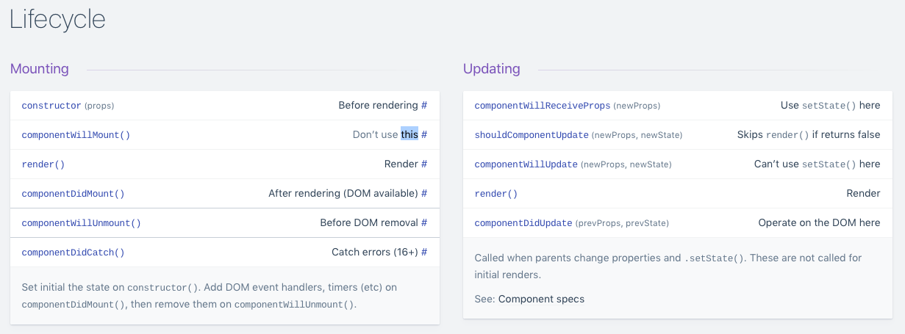

# React  

## Primeros pasos con React + Babel  

Algunos proyectos con ejemplos sencillos para entender como funcionan internamente React y Babel.

  

--------

## Ciclo de vida de los componentes  

  

  